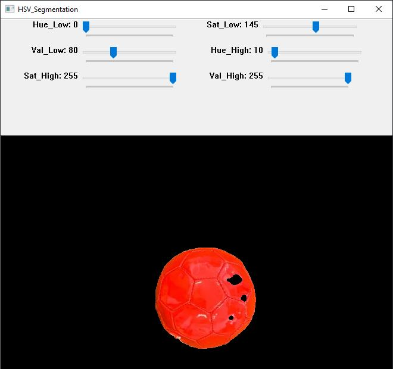
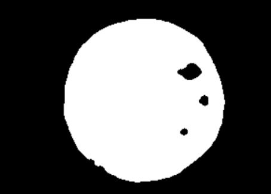

# Ball-Detection-and-Tracking-Algorithm
This program uses a combination of both Python3 and OpenCV to perform both the Detection and Tracking of a Size 1 Red Soccer Ball.

<b> Note: The PYCharm IDE was utilised for this system, if you are having trouble running this system using a different IDE, then please download PYCharm as it has the necessary inbuilt functions. 

In order to perform the Ball Detection and Tracking algorithm, the code is split into two segments, including: 
- Part 1: Colour Range Identification Program 
- Part 2: Ball Detection and Tracking Program 

## Part 1: Install the Colour Range Identification Program and find the HSV range of the ball 
This step needs to be conducted first as the HSV range determined from this package will be utilised in the <b> Ball Detection and Tracking Algorithm.</b> This can be done by following these steps: 
  1. Download the python file: 'ColourRangeIdentification.py' from the 'Part1' folder and open this into your preferred IDE. 
  2. You can use the 'red3.jpg' file as an example or replace this file with an image of the ball you are hoping to use this program on. 
  3. Once this code is opened in your IDE and your image is inserted, run the program. 
  4. You will find that three different windows will open, including:
  
       a) 'Original' - The original image of the ball you uploaded, for example: 'red3.jpg'
  
       b) 'Mask' - The final masked output of the ball using the HSV range 
  
       c) 'HSV_Segmentation' - The interactive window that will let you alter the low and high HSV ranges for the uploaded                         image.
  5. In this step you will need to use the Sliders in the 'HSV_Segmentation' window, move them until only the ball is visible as shown        in the figure below.
  
  

  

                                                
  6. Now that these new Slider values for the HSV have been configured, the 'Mask' window should now look similar to the Figure below,        where the mask has been created of the ball. 
  
   

  

 

  Note: Keep a copy of the upper and lower values of the HSV that you have configured in this program, as these will be used in the         following program (Part 2)
                                                  
 ## Part 2: Install the Ball Detection and Tracking Program
For this program, the resizing function (imutils.resize) for the Video Stream window and the Contour finding function (imutils.grab_contours) are commands utilised from the Imutils Library. In order to install this Library, use the pip command: 
  - $ pip install imutils
  
Now that this library is installed, you can download the 'BallDetectionandTracking.py' file from the 'Part2' folder. 
The following steps will need to be followed, in order to properly configure this code for your own use: 
 1. First off you will need to update the 'Red_LowerRange' and 'Red_UpperRange' variables with your HSV range values determined from         Part 1.
 2. Next, you can run this program, if you notice that the frame showing your live Video Stream is experiencing lag, then you will           need to reduce the size of the frame's width on line 32. As this will allow a higher frames per second to be achieved. 
 3. The remainder of the code should work for any colour ball you are using as long as you have determined the HSV range                     successfully.
 4. When running the code, you should be able to see the ball with its circumference outlined once it has been detected, in additon         to its contrail of tracked position values when moving, as shown below. 
    

 
    
Note: There is no key assigned to cancel these window frames, so in order to stop this software you will have to manaully stop the program through the IDE you are using. 
